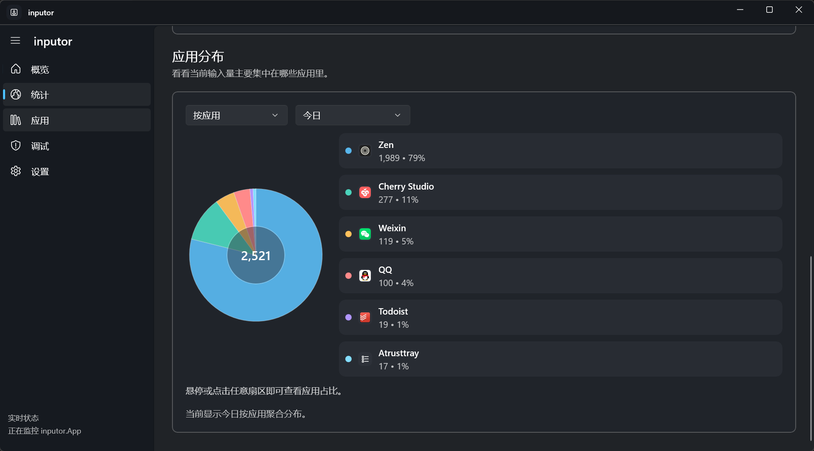

# inputor

> Privacy-safe Chinese and English input statistics for Windows

[中文](README.md)

---

inputor silently tracks how many Chinese and English characters you type in each application every day, helping you understand your input habits and work patterns. It **never records raw text** — only character counts and metadata are persisted.



## Features

- **Per-app statistics** — separate Chinese and English character counts for each application
- **Trend charts and heatmap** — visualise how your input volume changes over time
- **IME-aware counting** — handles composition sequences from Sogou Pinyin, Microsoft Pinyin, and similar IMEs correctly
- **System tray integration** — runs quietly in the background, out of your way
- **CSV export** — export statistics to `%Documents%\inputor-exports`
- **Local storage only** — all data stays on your machine under `%LocalAppData%\inputor`; no network access

## Privacy Guarantee

Zero raw-text persistence is a core design constraint:

- Raw input text is used only transiently in memory for snapshot diffing
- Disk, logs, and exports contain **only character counts, app names, and date-bucketed statistics**
- Password fields are automatically excluded
- No telemetry, no network calls

## Known Limitations

- Counting relies on the focused control exposing text through Windows UI Automation; some custom editors may not be supported
- Elevated windows (UAC prompts, etc.) cannot be monitored
- Password fields are excluded by design

## Installation

Download the latest release from the [Releases](../../releases) page:

| File | Description |
|------|-------------|
| `inputor-x.x.x-setup-win-x64.exe` | Installer (recommended) |
| `inputor-x.x.x-portable-win-x64.zip` | Portable — unzip and run |

**Requirements**: Windows 10 1809 or later, x64

> Both packages automatically deploy the Windows App Runtime if it is not already installed.

## Building from Source

**Requirements**: .NET 8 SDK, Windows 10 SDK

```bash
git clone https://github.com/shiquda/inputor.git
cd inputor
dotnet restore inputor.sln
dotnet build inputor.sln
dotnet run --project src/inputor.WinUI/inputor.WinUI.csproj
```

To build release packages (requires [Inno Setup 6](https://jrsoftware.org/isinfo.php)):

```bash
just publish
```

Output is placed under `artifacts/publish/`.

## CLI Probes

```bash
# Count supported characters
dotnet run --project src/inputor.WinUI/inputor.WinUI.csproj -- --count-sample "Hello世界"

# Simulate an IME composition sequence
dotnet run --project src/inputor.WinUI/inputor.WinUI.csproj -- --simulate-sequence "你|你好|你好世|你好世界"

# Simulate paste detection
dotnet run --project src/inputor.WinUI/inputor.WinUI.csproj -- --simulate-paste "Hello" "Hello World" "World"

# Simulate bulk-load filtering
dotnet run --project src/inputor.WinUI/inputor.WinUI.csproj -- --simulate-bulk 12 "Hello world" "Edit" false
```

## Contributing

Issues and pull requests are welcome. Please read [CONTRIBUTING.md](CONTRIBUTING.md) before submitting.

## License

This project is licensed under the [GNU General Public License v3.0](LICENSE).
