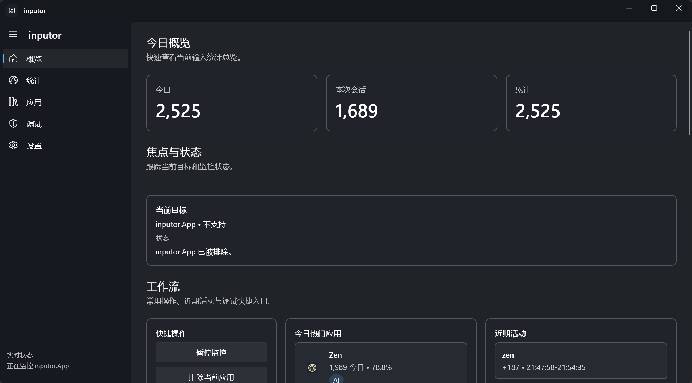
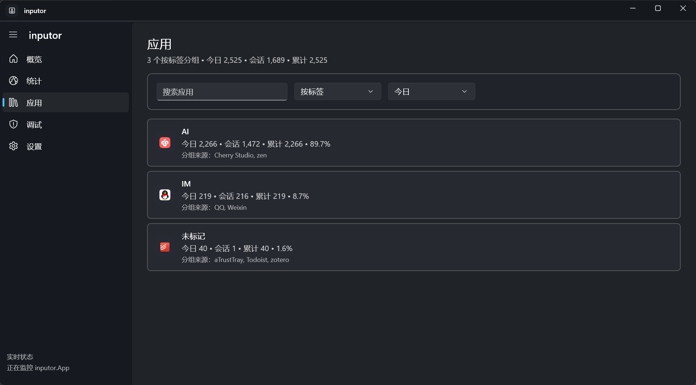

# inputor 使用手册

> Windows 平台隐私安全的中英文输入统计工具

本文档面向普通用户，介绍 inputor 的安装、界面功能与日常使用方式。

---

## 目录

- [安装与启动](#安装与启动)
- [界面总览](#界面总览)
- [各页面说明](#各页面说明)
  - [概览页](#概览页)
  - [统计页](#统计页)
  - [应用页](#应用页)
  - [调试页](#调试页)
  - [设置页](#设置页)
- [系统托盘](#系统托盘)
- [数据导出](#数据导出)
- [隐私说明](#隐私说明)
- [已知限制](#已知限制)
- [常见问题](#常见问题)

---

## 安装与启动

1. 前往 [Releases](https://github.com/shiquda/inputor/releases) 页面下载最新版本：

   | 文件 | 说明 |
   |------|------|
   | `inputor-x.x.x-setup-win-x64.exe` | 安装包（推荐） |
   | `inputor-x.x.x-portable-win-x64.zip` | 便携版，解压后运行 `inputor.App.exe` |

2. **系统要求**：Windows 10 1809 或更高版本，x64 架构。
3. 安装完成后，双击桌面快捷方式或从开始菜单启动 **inputor**。
4. 启动后程序自动开始后台监控，主窗口可关闭——程序会最小化到系统托盘继续运行。

---

## 界面总览

主窗口左侧为导航栏，包含五个页面入口：

| 导航项 | 说明 |
|--------|------|
| 概览 | 今日统计摘要、当前焦点应用、快捷操作 |
| 统计 | 趋势折线图、热力图、应用分布环形图 |
| 应用 | 按应用或标签分组查看输入量 |
| 调试 | 实时事件流，用于排查统计问题 |
| 设置 | 应用配置、数据导出与管理 |

导航栏底部实时显示当前监控状态。

---

## 各页面说明

### 概览页



概览页提供当日输入情况的快速摘要，分三个区域：

- **今日 / 本次会话 / 累计**：三个指标卡片，一览当日、本次开机会话和历史累计的字符输入总量。
- **焦点与状态**：显示当前前台应用及其监控状态（正常监控 / 不支持 / 已排除）。
- **工作流**：
  - *快捷操作*：暂停/恢复监控、排除当前应用等常用按钮。
  - *应用快捷操作*：对于高噪声应用，可直接隐藏/排除，也可编辑别名或分组，减少统计页面干扰。
  - *今日热门应用*：输入量最多的应用及占比。
  - *近期活动*：最近几条输入记录（时间段 + 字符增量）。

---

### 统计页


统计页支持多种维度的数据可视化：

- **趋势图**：以折线图展示近期每日输入总量变化。
- **热力图**：以日历热力图形式展示历史输入强度分布。
- **应用分布**（如上图）：环形图直观呈现各应用的输入占比，右侧列表给出具体数值。

**筛选控件**（页面右上方）可切换聚合维度（按应用 / 按语言）和时间范围（今日 / 本周 / 本月 / 全部）。

> 💡 悬停或点击环形图中的扇区，可高亮查看对应应用的输入量与占比。

---

### 应用页



应用页列出所有被监控过的应用，并支持两种分组方式：

- **按应用**：每行显示一个应用及其今日 / 会话 / 累计输入量。
- **按标签**（如上图）：将应用归入自定义标签组（如 AI、IM、未标记），汇总显示每组的总输入量和占比。

**标签管理**：在设置页可为应用添加标签，方便按工作类型汇总统计。

**搜索框**可按应用名称快速过滤列表。

---

### 调试页

调试页面向高级用户，实时滚动显示 inputor 捕获到的输入事件流。默认情况下，调试记录只缓存在内存中，不会写入统计文件，也不会被导出。

你可以在这里看到：

- 前台应用名称与控件类型
- 文本快照内容（仅差值计算用，**不持久化**）
- 字符计数变化量
- 是否触发粘贴检测或批量加载过滤

如遇到统计数字异常（偏高 / 偏低 / 不更新），可在此页面实时观察原始事件，协助排查。

调试页还支持将事件流追加写入你指定的本地文本文件：

- 先点击「选择文件位置」指定日志文件。
- 再开启「写入文件」开始/暂停落盘。
- 可选开启「包含原始输入文本（高风险）」；该选项默认关闭。

> ⚠️ 隐私提醒：磁盘调试日志默认不会开启；若你主动启用 raw text 选项，实际输入的文字会被写入该日志文件。建议仅在本地排障时短暂启用，并在使用后手动删除。

---

### 设置页

设置页提供以下配置项：

| 设置项 | 说明 |
|--------|------|
| 主题 | 跟随系统，或固定为浅色 / 深色 |
| 语言 | 切换应用界面语言；修改后需重启生效 |
| 开机自启 | 系统登录后自动在后台启动 inputor |
| 排除应用列表 | 不希望被统计的应用，可在此添加或移除 |
| 应用标签管理 | 为应用分配一个或多个标签，供应用页按标签聚合使用 |
| 应用快捷操作 | 可快速隐藏高噪声应用，或编辑应用别名与分组 |
| 版本信息 | 查看应用版本、构建版本和当前渠道 |
| 导出今日 CSV | 将今日统计导出为 CSV 文件到 `%Documents%\inputor-exports` |
| 统计源路径 | 输入一个 JSON 文件路径后，可立即切换到该统计源 |
| 备份当前统计源 | 导出包含统计数据与设置的 ZIP 备份，便于迁移或归档 |
| 恢复 ZIP 备份 | 从备份包恢复统计数据与设置；失败时会自动回滚 |
| 打开数据目录 | 直接打开 `%LocalAppData%\inputor` 数据目录 |
| 清空图标缓存 | 删除本地图标缓存，强制重新生成应用图标 |
| 恢复默认统计源 | 放弃自定义统计源，切回默认 LocalAppData 数据源 |
| 清空数据 | 删除当前统计源中的已保存统计记录（不可撤销） |

---

## 系统托盘

inputor 支持最小化到系统托盘后台运行：

- 关闭主窗口后，程序继续在托盘中静默运行。
- **左键点击**托盘图标：显示/隐藏主窗口。
- **右键点击**托盘图标：弹出快速菜单，可查看今日统计摘要、暂停监控或退出程序。

---

## 数据导出

在**设置页**点击「导出今日 CSV」，inputor 会将当前日期的统计数据以 CSV 格式保存到：

```
%Documents%\inputor-exports\
```

导出文件按日期命名，包含每个应用当日的中文字符数、英文字符数及合计。可用 Excel、Numbers 等工具打开分析。

如果你想迁移或归档完整统计数据，可在设置页使用「备份当前统计源」生成 ZIP 备份。备份包会包含统计数据、设置快照和 manifest 信息；在另一台机器上可通过「恢复 ZIP 备份」导入。若你只想切换到某个现有 JSON 文件，也可以继续使用「统计源路径」功能。

---

## 隐私说明

inputor 的核心设计原则是**零原始文本持久化**：

- 原始输入文本默认仅在内存中短暂用于快照差值计算，**不会进入常规统计存储或导出**。
- 本地存储（`%LocalAppData%\inputor`）中只存在字符计数、应用名称和日期分桶统计。
- 导出的 CSV 文件同样只含计数数据，不含任何文本内容。
- 密码输入框（PasswordBox 类型控件）**自动排除**，不参与统计。
- 不收集任何遥测数据，不访问网络。

> 例外：调试页允许你显式开启磁盘日志；若进一步勾选「包含原始输入文本（高风险）」，原始输入片段会写入你指定的日志文件。该功能默认关闭，仅用于本地排障。

---

## 已知限制

| 限制 | 说明 |
|------|------|
| 部分应用不支持 | 统计依赖 Windows UI Automation 暴露文本内容，使用自定义渲染引擎的编辑器（如部分游戏、Electron 应用）可能无法被识别 |
| 管理员权限窗口 | UAC 弹窗及以管理员权限运行的窗口无法被监控 |
| 密码输入框 | 自动排除，不统计 |
| 悬浮字符统计 | 暂无桌面悬浮窗，只能通过主窗口或托盘菜单查看 |

---

## 常见问题

**Q：inputor 会记录我输入的内容吗？**  
A：不会。inputor 只统计字符数量，从不保存、展示或传输你输入的文字本身。

**Q：为什么某个应用的输入量始终为 0？**  
A：该应用可能不支持 Windows UI Automation，或已被加入排除列表。可在调试页查看实时事件确认。

**Q：数据保存在哪里？**  
A：`%LocalAppData%\inputor\`，可通过文件管理器打开查看。

**Q：如何彻底卸载并清除数据？**  
A：先通过控制面板卸载程序，再手动删除 `%LocalAppData%\inputor` 目录即可。

**Q：如何把统计数据迁移到另一台电脑？**  
A：在设置页使用「备份当前统计源」导出 ZIP 备份，再在目标机器上用「恢复 ZIP 备份」导入即可。

**Q：调试日志会不会保存我输入的原文？**  
A：默认不会。只有你在调试页主动开启磁盘日志，并额外勾选「包含原始输入文本（高风险）」时，原文才会写入你指定的本地日志文件。

**Q：便携版和安装版有什么区别？**  
A：功能完全相同。安装版会创建快捷方式并注册卸载程序；便携版解压即用，不写注册表，适合在不同电脑间携带使用。
